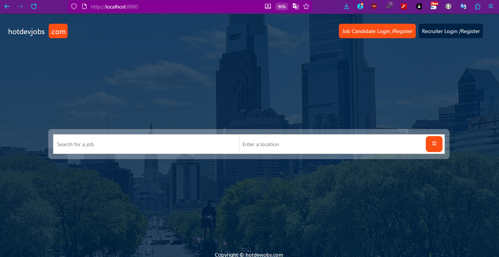
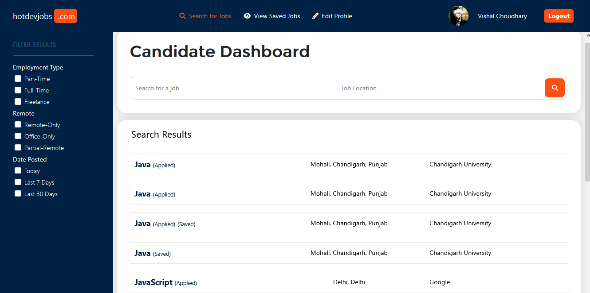
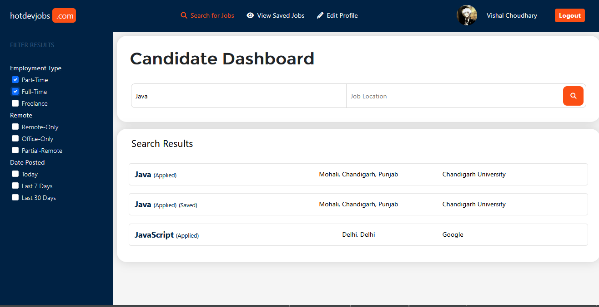
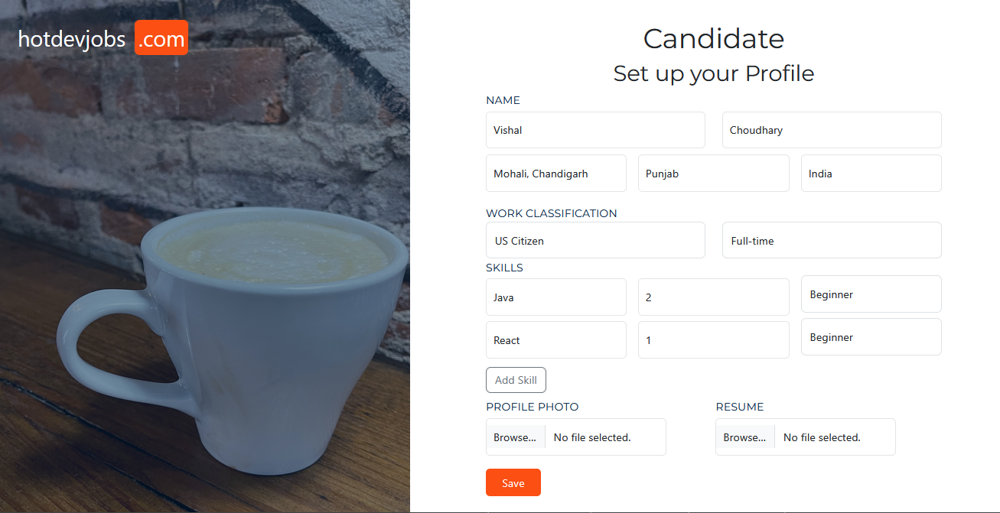
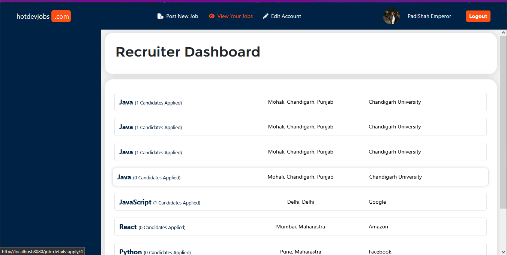
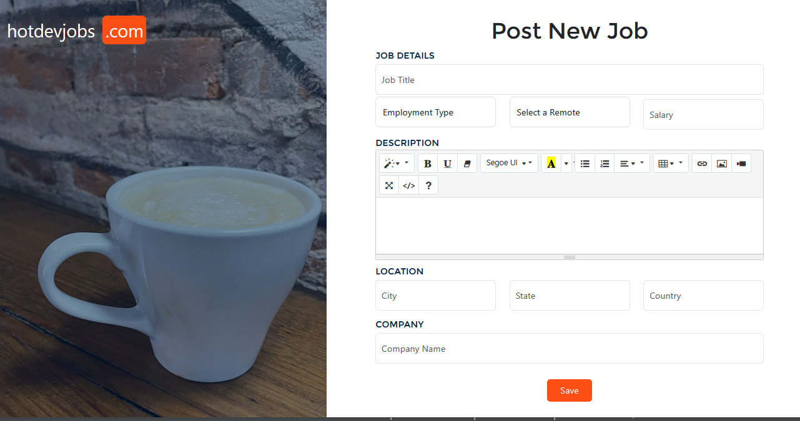

# 🚀 JobPortal - Full Stack Spring Boot MVC Application

A robust **Spring Boot MVC** web application designed to bridge the gap between recruiters and job seekers. This platform features a dual-role system (Recruiter & Job Seeker) with secure authentication, profile management, and an interactive job application workflow.

🔹 Demo: https://youtu.be/vzssp40wKtw
---

## 📊 Database Schema
The application uses a relational database to manage complex relationships between users, job posts, locations, and application statuses.


---

## 💻 Visual Walkthrough

### 1. Welcome & Authentication
Secure entry point for all users. The application uses **Spring Security** to handle role-based redirection.

| Landing Page | Secure Login |
| :--- | :--- |
|  |  |

### 2. Candidate (Job Seeker) Experience
Job seekers can build their professional profiles, upload resumes, and track their applications.

* **Dashboard:** High-level view of application activity.
* **Job Search:** Advanced filtering to find the right role.
* **Profile:** Centralized hub for personal details and resume management.

| Candidate Dashboard | Job Search | Profile Management |
| :--- | :--- | :--- |
|  |  |  |

### 3. Recruiter Experience
Recruiters have a powerful interface to post new job openings and manage incoming talent.

* **Job Posting:** Built-in QuillJS integration for rich text job descriptions.
* **Candidate Review:** View detailed profiles and download resumes directly from the portal.

| Recruiter Dashboard | Posting New Jobs (QuillJS) |
| :--- | :--- |
|  |  |

---

## 🛠️ Project Architecture & Structure

The project follows the **Layered Architecture** pattern to ensure clean separation of concerns:

* **`com.vishal.jobportal.config`**: Security (Spring Security) and Web MVC configurations.
* **`com.vishal.jobportal.controller`**: Handles HTTP requests and navigation logic.
* **`com.vishal.jobportal.entity`**: JPA Data models (Users, Jobs, Skills, etc.).
* **`com.vishal.jobportal.repository`**: Data Access Layer using Spring Data JPA.
* **`com.vishal.jobportal.services`**: Core business logic and service implementations.
* **`com.vishal.jobportal.util`**: Utilities for File Upload/Download (Resumes/Images).
* **`src/main/resources/templates`**: Server-side rendering with Thymeleaf.

---

## ⚙️ Technologies Used

* **Backend:** Java, Spring Boot, Spring Security, Spring Data JPA.
* **Frontend:** Thymeleaf, HTML5, CSS3, JavaScript.
* **Database:** MySQL / PostgreSQL.
* **Tools:** Maven, QuillJS (Rich Text Editor).

---

## 🚀 Getting Started

1.  **Clone the project:**
    ```bash
    git clone [https://github.com/your-username/JobPortal.git](https://github.com/your-username/JobPortal.git)
    ```
2.  **Database Setup:**
    Configure your database credentials in `src/main/resources/application.properties`.
3.  **Run:**
    Execute `mvn spring-boot:run` or run `JobportalApplication.java` from your IDE.
4.  **Explore:**
    Open `http://localhost:8080` in your browser.
